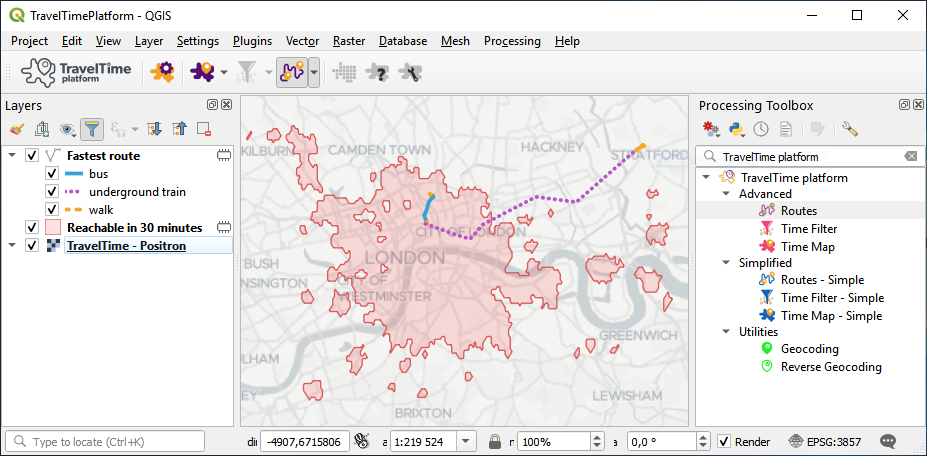

# TravelTime platform plugin for QGIS  

This is the official home for the TravelTime platform plugin for QGIS.

*Travel time is much more accurate than distance to make informed decisions, such as where to locate a new office, what type of transport to choose, or at what time a meeting should start.*

*The TravelTime platform Plugin for QGIS adds several algorithms that aim to allow this type of analysis right in QGIS. It works by making use of the TravelTime platform API, an extremely fast web service for such computations.*

To learn more about TravelTime platform and to discuss commercial licences visit [our website](http://traveltimeplatform.com).

## Help contents

- **[The reference manual](reference.md)**
Which contains detailed information about all aspects of the plugin, from installation to detailed configuration.
- Three small tutorials to quickly dive in :
    - **[The basics](tutorial_01.md)**  
    About basic usage of the plugin
    - **[The algorithms](tutorial_02.md)**  
    About using the algorithms
    - **[Going further](tutorial_03.md)**  
    About what else can be done in conjunction with QGIS's features

## Additionnal support

- **[Issue tracker](https://github.com/igeolise/traveltime-platform-qgis-plugin/issues)**
- **[Contact us](https://www.traveltimeplatform.com/contact-us)**
- **[QGIS help resources](https://docs.qgis.org/3.4/en/docs/training_manual/index.html)**

