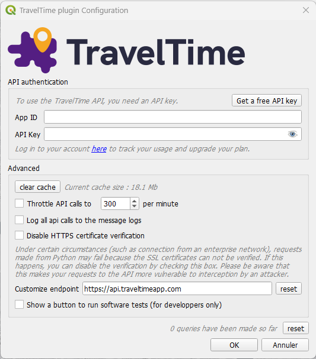
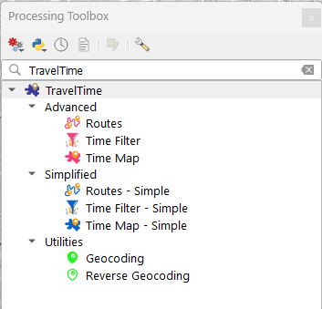
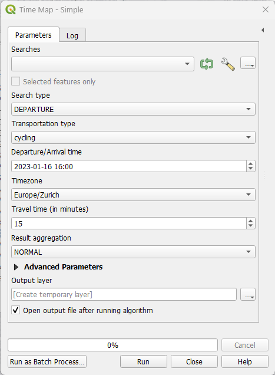

<link rel="stylesheet" type="text/css" href="style.css" />

# Reference manual  

This reference manual covers all features of the TravelTime platform plugin for QGIS.

For an introduction about how to use it, you may prefer to have a look at the tutorials first.

## Installation

### Requirements

This plugins works on QGIS version 3.0 or higher.

### Install

The plugin can be installed using the QGIS plugin manager.

Choose `Manage and install plugins` from the `Plugin menu`.

In the plugin manager window, make sure you are on the the `All` tab, and search for `TravelTime`. The plugin will appear in the list. Select it in the list, and click on `install`.

### Upgrade and uninstall

If an update is available, you will get notified from the main QGIS window. The plugin can be upgraded or uninstalled from the plugin manager window.

## User interface

### Splash screen

After installation and on QGIS start, the plugin will show a splash screen. You can prevent it from showing again by checking the `don't show again` checkbox.

### Toolbar

### Move, show or hide

By default, the toolbar appears at the top of the window. You can drag and drop it to move it elsewhere, or completely toggle it's visibility by right-clicking on an empty space of the user interface and by (un)checking "TravelTime platform toolbar".

### Content

 Open the QGIS processing toolbox showing available algorithms.

   Express tools (map tools versions of the algorithms)

 Show [background tiles](#Background%20tiles)

 Open [online help](#Help%20Dialog)

 Open the [settings dialog](#Settings%20Dialog)

### Menu

The same actions are also available from the `plugin menu`.

## Express tools

*Express tool* are map tools that allow to run the algorithms directly using click inputs on the map. These tools are the perfect way to get started with the plugin.

###  Time Map Express

This runs the *express time map* tool. In the background, the advanced time map algorithm will be run. This algorithms returns a **polygon** layer representing the area that can be reached from one point, or the area from which a point can be reached.

Usage : click the action, then click somewhere on the map canvas to create a time map. A new layer will be added to the project with the time time. That layer is a "temporary layer". If you need to save it, right click on it in the legend, and choose `Make permanent`.

Configuration : click on the small arrow, then configure using the following widget.

###  Time Filter Express

This runs the *express time filter* tool. In the background, the advanced time filter algorithm will be run. This algorithms allows to filter a **point** layer according to a time map search.

Usage : first, select a **point** layer in the legend, then click the action, then click somewhere on the map canvas to create a time map. A new layer will be added to the project with the reachable and unreachable points. That layer is a "temporary layer". If you need to save it, right click on it in the legend, and choose `Make permanent`.

Configuration : click on the small arrow, then configure using the following widget.

###  Route Express

This runs the *express route* tool. In the background, the advanced route algorithm will be run. This algorithms allows to compute the best route between points.

Usage : click the action, then click somewhere on the map canvas to define the starting point, and click again to define the destination point. A new layer will be added to the project containing the route. That layer is a "temporary layer". If you need to save it, right click on it in the legend, and choose `Make permanent`.

Configuration : click on the small arrow, then configure using the following widget.

## Settings dialog

The main settings dialog can be open using the  icon.

**App ID** and **API Key** : enter your App ID and API Key here. You need to do this step to be able to use the TravelTime web service. You can get the ID and the Key by email by clicking on the **Get a free API key** button and filling out the web form. 

**API usage warning** : this section allows to configure a warning limit for API usage. By default, free API keys have a relatively low limit of 10 queries / minutes, after which queries will be refused. To avoid hitting this limit without noticing, the plugin refused to run algorithms that would go over the limit defined here. You can :
- disable the warning completely by unchecking the box
- increase the number of queries after which the limit kicks in
- reset the queries count

**Clear cache** : this button allows to clear the request cache. All requests are saved to a cache file, to avoid the need of hitting the API if an identical request was already made. By clearing the cache, all saved queries will be deleted. This shouldn't be necessary unless you have a very high usage of the application and the cache file gets too big.

**Log api calls to the message logs** : this settings makes the plugin log all requests and responses to the QGIS Message Log, allowing to inspect what's happening in case you encounter errors.

**Disable HTTPS certificate verification** : under certain circumstances (such as connection from an enterprise network), requests made from Python may fail because the SSL certificates can not be verified. If this happens, you can disable the verification by checking this box. Please be aware that this makes your requests to the API more vulnerable to interception by an attacker.

## Help dialog

The online help dialog can be open using the  icon.

This dialog shows the online help directly in QGIS.

**Return to help index** : returns to the home page of the online help in case you got lost.

**Open in browser** : opens your browser at the same page, which may be more comfortable to browse the documentation.

## Background tiles

The background tiles icon  opens up the browser at the XYZ tiles section. To use a background layer, double click it in the list or drag it into the map canvas.

Depending on your API key capabilities, it will automatically add additionnal XYZ layers that you can use as background.

 

If your API key doesn't provide this capability, you will get a message providing instructions in how to get access to those tiles.

In any case, you'll be able to add the default XYZ layer configured by default by QGIS.

## Algorithm toolbox

The processing toolbox can be open using the . The only difference with the regular `open toolbox` action is that the list of actions will be prefiltered to show only TravelTime platform relative algorithms.

Similarly to all other QGIS algorithms, all those algorithms can be run normally by double-clicking them or in batch mode by right-clicking them.

### Simple

Algorithms regrouped under the `Simple` group provide simplified access to the advanced algorithms, but just call the advanced algorithms in the background. They cover most use cases and it is recommended to start with those before using the `Advanced` ones.

 Run the [simplified time filter algoritm](#Time%20map%20(Simplified))

 Run the [simplified time map algoritm](#Time%20filter%20(Simplified))

 Run the [simplified route algoritm](#Route%20(Simplified))

### Advanced

Algorithms regrouped under the `Advanced` group provide access to the API endpoints. Since they have a lot of options, they are only recommended for advanced users that require to fine tune parameters that are not configurable in the simplified versions.

 Run the [advanced time filter algoritm](#Time%20map%20(Advanced))

 Run the [advanced time map algoritm](#Time%20filter%20(Advanced))

 Run the [advanced route algoritm](#Route%20(Advanced))

### Utils

Algorithms regrouped under the `Utilities` group provide access to the Geocoding (assigning a point to a textual address) or Reverse geocoding (assigning a textual address to a point). algorithms.

 Run the [geocoding algoritm](#Geocoding)

 Run the [reverse geocoding algoritm](#Reverse%20geocoding)

## Algorithms

<!-- 
p = travel_time_platform_plugin.provider.Provider()
p.loadAlgorithms()
for p in p.algorithms():
    p.help_text()
-->

###  Time map (Simplified)

This algorithms provides a simpified access to the time-map endpoint.

It can be used to get informations such as a service area polygon based on travel time of different means of transport.

[TODO : INSERT EXAMPLE]

#### Parameters description

**Searches:** Choose a point layer from which represents input coordinates.

**Search type:** Whether the coordinates represent the departure or the arrival points.

**Transportation type:** Which transportation types to consider.

**Departure/Arrival time (UTC):** The departure or arrival time. Searches are time dependent, as depening on the date/time, public transport or trafic condition may be different. 

**Travel time (in minutes):** The total duration from arrival to destination.

**Result aggregation:** 
- NORMAL will return a polygon for each departure/arrival search
- UNION will return the union of all polygons for all departure/arrivals searches.
- INTERSECTION will return the intersection of all departure/arrival searches.

**Output layer:** Where to save the output layer. If you leave this empty, the result will be loaded as a temporary layer. It is still possible to save a temporary layer afterwards by right-clicking it in the legend and choosing "make permanent".

###  Time filter (Simplified)

This algorithms provides a simpified access to the time-filter endpoint.

It can be used to get filter a point layer using a time search.

[TODO : INSERT EXAMPLE]

#### Parameters description

**Searches:** Choose a point layer from which represents input coordinates.

**Search type:** Whether the coordinates represent the departure or the arrival points.

**Transportation type:** Which transportation types to consider.

**Departure/Arrival time (UTC):** The departure or arrival time. Searches are time dependent, as depening on the date/time, public transport or trafic condition may be different. 

**Travel time (in minutes):** The total duration from arrival to destination.

**Locations:** The points layer to search from.

**Output layer:** Where to save the output layer. If you leave this empty, the result will be loaded as a temporary layer. It is still possible to save a temporary layer afterwards by right-clicking it in the legend and choosing "make permanent".

###  Route (Simplified)

This algorithms provides a simpified access to the route endpoint.

It can be used to get the best routes between two sets of points.

[TODO : INSERT EXAMPLE]

#### Parameters description

**Searches:** Choose a point layer from which represents input coordinates.

**Search type:** Whether the coordinates represent the departure or the arrival points.

**Transportation type:** Which transportation types to consider.

**Departure/Arrival time (UTC):** The departure or arrival time. Searches are time dependent, as depening on the date/time, public transport or trafic condition may be different. 

**Locations:** The points layer to search from.

**Output style:** 
- NORMAL : return one linestring per route
- DETAILED : return one linestring per route segment (allows to map mulimodal routes)

**Output layer:** Where to save the output layer. If you leave this empty, the result will be loaded as a temporary layer. It is still possible to save a temporary layer afterwards by right-clicking it in the legend and choosing "make permanent".

###  Time map (Advanced)

This algorithms provides advanced access to the time-map endpoint.

As it has a lot of options, it is recommended for begginers to rather use the simplified version of this algorithm.

It can be used to get informations such as a service area polygon based on travel time of different means of transport.

[TODO : INSERT EXAMPLE]

#### Parameters description

The parameters match closely the API. They are best documented on http://docs.traveltimeplatform.com/reference/time-map/ .

All parameters are expressions, which allow you to freely use the QGIS expression engine to define each of those parameters, which includes access to all features attributes.

#### Differences with the API

In the API, it is possible to specify which intersections or unions to compute. This doesn't work well with typical GIS tabular inputs, so that this algorithms only allows to compute the INTERSECTION or UNION on all inputs.

Consider using this algorithm in conjunction with other QGIS algorithms if you need advanced INTERSECTION or UNION features.

###  Time filter (Advanced)

The parameters match closely the API. They are best documented on http://docs.traveltimeplatform.com/reference/time-filter/ .

All parameters are expressions, which allow you to freely use the QGIS expression engine to define each of those parameters, which includes access to all features attributes.

#### Differences with the API

In the API, all coordinates are to be provided in the `locations` parameter, and then searches specify locations ids. As this doesn't suit well GIS workflows, the algorithm separares source for searches and for location.

###  Route (Advanced)

The parameters match closely the API. They are best documented on http://docs.traveltimeplatform.com/reference/routes/ .

All parameters are expressions, which allow you to freely use the QGIS expression engine to define each of those parameters, which includes access to all features attributes.

#### Differences with the API

In the API, all coordinates are to be provided in the `locations` parameter, and then searches specify locations ids. As this doesn't suit well GIS workflows, the algorithm separares source for searches and for location.

###  Geocoding

This algorithms provides a simpified access to the geocoding endpoint.

It can be used to assign geographical coordinates to textual data such as addresses.

[TODO : INSERT EXAMPLE]

#### Parameters description

**Input data:** The input layer. This layer should have attributes representing an address or a location name.

**Restrict to country:** Only return the results that are within the specified country

**Results type:** 
- ALL will return several results per input, corresponding to all potential matches returned by the API.
- BEST_MATCH will only return the best point.

**Search expression:** The field containing the query to geocode. Can be an address, a postcode or a venue. For example SW1A 0AA or Victoria street, London. Providing a country or city the request will get you more accurate results

**Focus point:** This will prioritize results around this point. Note that this does not exclude results that are far away from the focus point

**Output layer:** Where to save the output layer. If you leave this empty, the result will be loaded as a temporary layer. It is still possible to save a temporary layer afterwards by right-clicking it in the legend and choosing "make permanent".

###  Reverse geocoding

This algorithms provides a simpified access to the reverse geocoding endpoint.

It can be used to assign a textual address to geographical coordinates.

[TODO : INSERT EXAMPLE]

#### Parameters description

**Input data:** The input layer. This layer must have point geometries.

**Restrict to country:** Only return the results that are within the specified country.

**Results type:** 
- ALL will return several results per input, corresponding to all potential matches returned by the API.
- BEST_MATCH will only return the best match.

**Output layer:** Where to save the output layer. If you leave this empty, the result will be loaded as a temporary layer. It is still possible to save a temporary layer afterwards by right-clicking it in the legend and choosing "make permanent".

## Issues

Unfortunately, it may happen that you encounter some issues. This section may help address some of the most common issues.

### Common issues

#### Running the algorithms from the toolbox fail

Have a close look at the first few lines in red of the output, and see if you some corresponding help here.

##### Could not connect to the API

This means that the plugin could not connect to the webservice. Make sure you are online and that your connection works properly. If the error persists, please [contact us](#Contact%20us) as it may be due to some issue with the web service, .

##### You need a TravelTime platform API key to make requests

Before using the TravelTime platform plugin, you need to get and configure an API key. Please refer to the [configuration dialog](#Settings%20dialog) section about how to get and configure an API key.

##### WARNING : API usage warning limit reached

This means the algorithm got stopped because of the API limit warning. Please refer to the [configuration dialog](#Settings%20dialog) section about how to configure the API limit warning.

##### Application Id or Api Key is invalid

The application ID or the API key configured in the settings is invalid. Make sure you copied it correctly. If the error persist, please [contact us](#Contact%20us).

##### Could not connect to the API because of an SSL certificate error

This means that the plugin is not able to create a tion with the TravelTime web service. Please refer to the [configuration dialog](#Settings%20dialog) section about how to disable SSL certificate checking.

### Report on Github

If you encounter another issue that is not described above, please report it on the [issue tracker](https://github.com/igeolise/traveltime-platform-qgis-plugin/issues).

Include as much information as possible, such as what steps exactly triggered the issue, the error message or unexpected behaviour, a copy of the message log (`view > panels > Log messages ` under the `TravelTime platform` tab).

By doing so, we'll be able to fix the issue and you will be notified.

### Contact us

For anything else, including to request higher API limit, please visit https://www.traveltimeplatform.com/contact-us

