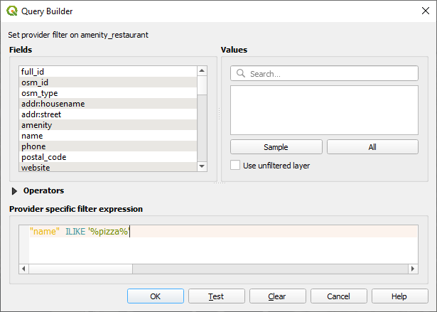
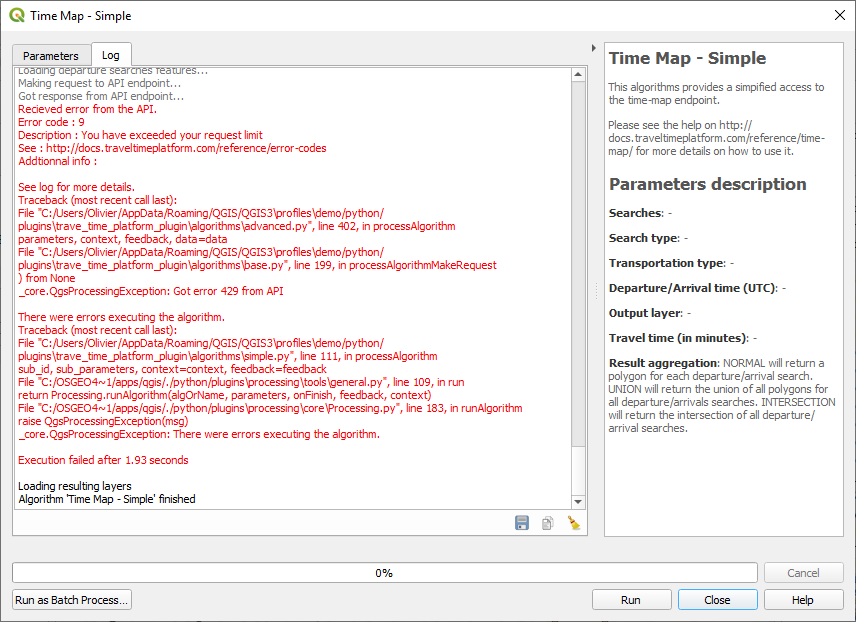
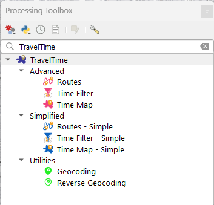
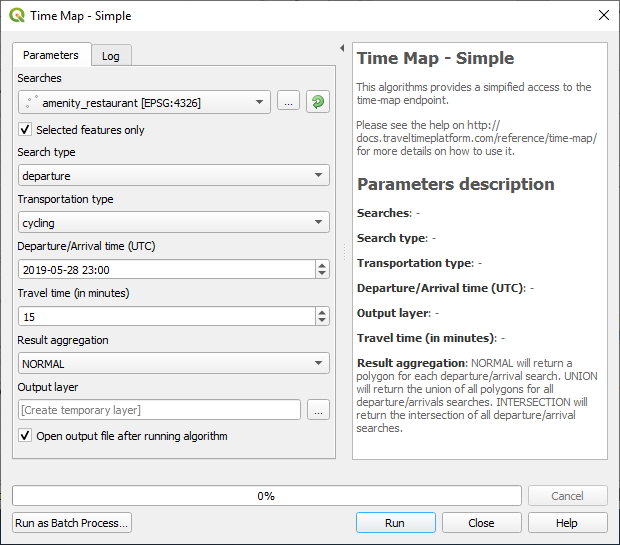
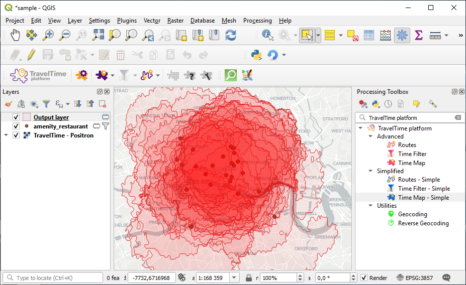
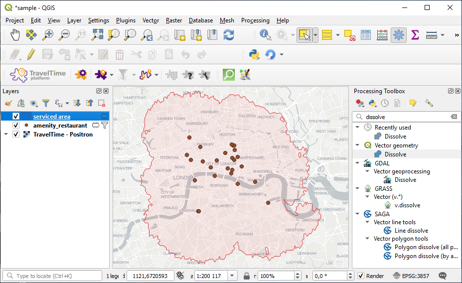

# Tutorial 02. Using the algorithms 

This tutorial covers intermediate usage of the TravelTime platform plugin. It looks at how to use the algorithms from the processing toolbox.

To learn more about TravelTime platform and to discuss commercial licences visit [our website](http://traveltimeplatform.com).

## Video version

This is the video version of the second tutorial. The exact same tutorial is also available in written form below.

<iframe width="560" height="315" src="https://www.youtube.com/embed/MiwIOBvDTbI" frameborder="0" allow="accelerometer; autoplay; encrypted-media; gyroscope; picture-in-picture" allowfullscreen></iframe>

## What we'll cover

During this tutorial, we'll cover :
- [The simplified algorithms from the toolbox](#the-simplified-algorithms)
- [The advanced algorithm from the toolbox](#the-advanced-algorithms)
- [Next steps](#what-next)

Make sure you followed the [first tutorial](tutorial_01.md) before doing this one, as you'll need some of the skills learned there to do this one.

We'll mostly focus on the Time map algorithm, but everything is applicable in similar ways to the other two algorithms. You may also learn a few nice things about QGIS if you're new to it !

## The simplified algorithms

Since last time, thanks to your accurate analysis techniques, your pizza business grew quite a lot. You now own all the pizzerias of your neighbourhood !

The justifies moving from the express tools to the simplified algorithms.

These algorithms work in a slightly different way than the map tools you used before. Instead of mouse clicks, they take inputs from other layers. It is slightly more complicated to setup, as you need actual inputs layers, but also much more powerful, as the analysis can be reproduced, and as you can process much more data at once.

To get started, we want to see what area your delivery fleet is able to cover, to see if we have gaps that we need to cover.

### 1. Setup a project

Just like last time, create a blank project, and add a background layer.

### 2. Loading data

Again, just like last time, let's load some data using QuickOSM. Do the same steps than last time, but choose "amenity" and "restaurant" in the dialog instead.

You'll get all restaurants in the map extent. As we just own pizzerias, and not all restaurants, we'll filter this layer. To do that, we'll use the `cuisine` attribute that comes with the OSM data.

Right-click on the new `amenity restaurants` layer, and choose filter. In the dialog, enter (exactly, look at the quotes carefully) `"cuisine"='pizza'`.

Click OK, and you should now have less points than before, representing only pizzerias.

### 3. Running the algorithm

> Just a note : the limitation of the number of queries you can make, which we saw already in tutorial 1, also applies when running the algorithms from the toolbox. The error will look a bit different though.

  
*An API limit error when running an algorithm*

We'll now feed in this layer into the Simplified Time map algorithm.

Make sure the `amenity restaurants` is selected in the layer, then press the selection icon . Drag a rectangle on the map to select the pizzerias  that you own. Make sure you have a select a reasonable amount of pizzerias (5-15).

Click on the toolbox icon  to open the processing toolbox (note that this is exactly equivalent to showing the toolbox using QGIS's default button, and then manually filtering the algorithms).

In the toolbox, double-click on the Simplified Time map algorithm  to open the main dialog.

Most of the parameters should look familiar. Choose the `amenity restaurants` layer in the first parameter to indicate that you want the searches to be taken from this layer. Make sure to check `Selected features only`. Set the travel time to 10 minutes and the transportation type to cycling.

When ready, click run. Your project should now look like this.

What a mess! It's quite hard to see anything at all... Let's see how to improve this.

### 4. Combination with other algorithms

We'll now dissolve all polygons into one, since what we were interested in is the total service area.

Still in the processing toolbox, search for the `dissolve` algorithm (using the small search bar). Double click it, choose `Output layer` as `Input layer`, and click run. You will get a new layer containing just one polygon. Let's rename it to `serviced area`.

We'll copy over the style from the first layer to the second one, as it looked better. Right click on the `Output` in the legend and choose `Styles > Copy style > All styles categories`, then right click on the `serviced area` layer and choose `Styles > Paste style > All styles categories`. You can now delete the `Output` layer.

Your project should now look like this.

Awesome !

Using different algorithms together is extremely powerful. Have a quick look at the quantity of algorithms in the toolbox. You'll be able to use all of those with the outputs of the TravelTime platform plugin, opening endless possibilities.

> Note : the algorithm has a "result aggregation" option that can be set to UNION. This option allows to get the dissolved polygons directly in one step. The only issue is that it works correctly only if the input layer has less than 10 points, after which the requests are made in batch to the endpoint, and thus several polygons are returned. So, if you're working with bigger datasets than 10 points, it's better to rely on the dissolved algorithm as shown.

## The advanced algorithms

You've shown the delivery map to your new shareholders, and they've been greatly impressed. They now ask you to make a map representing your coverage area for customers that come to your restaurants.

The issue is that you have two types of restaurants : the drive-through, that only serve cars, and the regular restaurants, that don't have a parking area, so that people cannot come by car.

We'll see how to deal with this using the advanced algorithms.

### 1. Preparing the data

First, we'll keep only the select points, as we don't need the other restaurants any more. To do so, select the `amenity_restaurant` in the legend, make sure you still have select points (they show up in yellow), then press `ctrl+C` (copy) and chose `Paste features as temporary scratch layer ` from the `edit` menu. This will create a new layer with just the selected points, which you could name `my restaurants`.

You can now delete the old `amenity_restaurant` layer.

We'll add some information to our restaurant. Right-click on the `my restaurants` layer, and choose `open attribute table`. Toggle the edit mode , and add a new field . Call the field `is_drive_through`.

Once this is done, still in the attribute table, scroll to the very right (there may be a huge amount of column, as this is how OSM's data is imported in QGIS), and click on a few random cells of the new `is_drive_through` column, to indicate that these restaurants are drive throughs.

Then, toggle the edit mode back off  and close the attribute table.

### 2. Running the advanced algorithm

Open the processing toolbox  and double click on the Advanced Time map algorithm  to open the dialog.

Again, some inputs may look familiar. But you'll notice there are more, especially under the `advanced` section, which allows to fine tune a lot of parameters.

We'll leave those for now. Pick the `my restaurants` layers as `Departure searches`. Click on the E next to `Departure / Transportation / Type`. This will allow us to enter an expression that will define the transportation type for each restaurant.

Enter the following expression (again, be careful to use the same type of quotes) `if( "is_drive_through" , 'driving', 'public_transport')`. This expression will return `driving` if the restaurant is a drive through, or `public_transport` if not.

When this is done, you can hit run. Now just do the same steps than before the dissolve the layer, and voilà !

Defining parameters using expressions is extremely powerful. Using the exact same approach, you could define different searches based on each restaurant's opening/closing hours, or even fine tune some parameters such as the parking time.

This concludes our second tutorial !

## What next

To continue discovering what the plugin has to offer, have a look at the next tutorial of the series : **[Tutorial 03. Going further with algorithms](tutorial_03.md)**.

Again, don't forget to have a look at the [reference documentation](reference.md), that describes everything the plugin does, as well as at the [TravelTime platform blog](https://blog.traveltimeplatform.com) which includes numerous quality articles around the TravelTime API.
