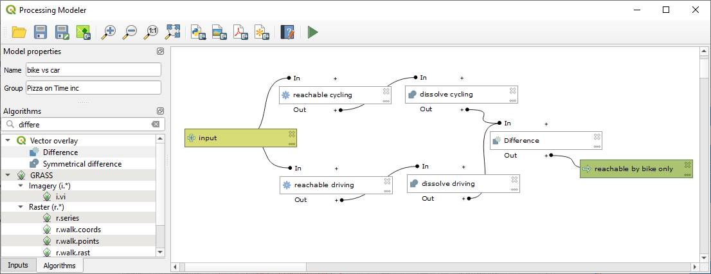
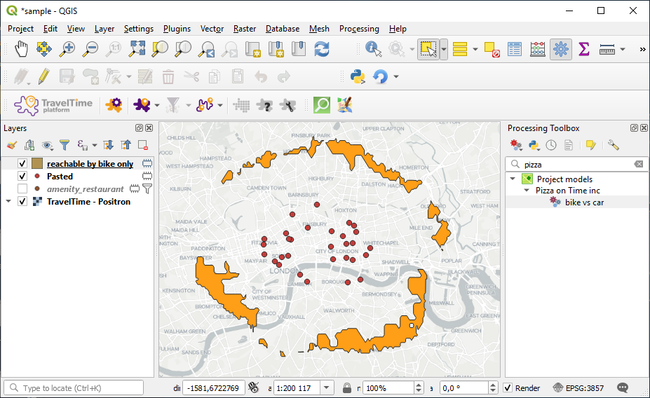
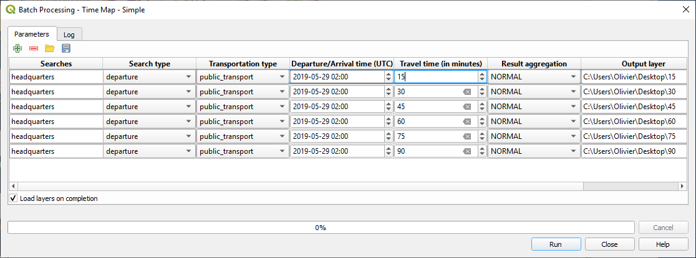
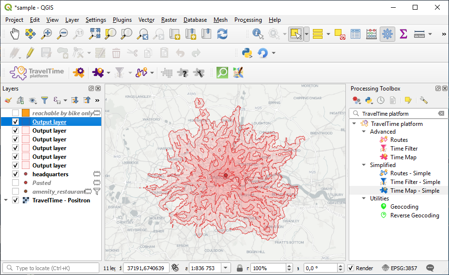

<link rel="stylesheet" type="text/css" href="style.css" />

# Tutorial 03. Making the most ouf of algorithms 

This tutorial intends to showcase how far it is possible to go using the TravelTime platform algorithms in conjunction with QGIS's capabilities.

## What we'll cover

During this tutorial, we'll cover :
- [Making and running a processing model](#Making%20and%20running%20a%20processing%20model)
- [Running algorithms in batch](#Running%20algorithms%20in%20batch) (including how to make isochrones)

Make sure you followed the [previous tutorial](tutorial_02.md) before doing this one, as you'll need some of the skills learned there to do this one.

## Making and running a processing model

Things continue to work well for your restaurant chain. Your shareholds now want you to switch from bike delivery to car delivery. You keep telling them it's a bad idea, as it covers a smaller area than a bike, but they are not convinced.

To convince them, you'll have to show them evidence...

We'll build a model that computes the areas that area reachable by biking in 15 minutes that would be unreachable by car ! What else could they ask for ?

### 1. Setup a project

We'll continue with the `my restaurants` layer that we produced in the last tutorial.

### 2. Create the processing model

Before we get started, let's clarify what we need to do to get the area that is reachable by bike but not by car :

1. create a time map for 15 minutes by bike
2. create a time map for 15 minutes by car
3. substract the area 2. from the area 1.

Open the processing toolbox  and select `create new model` under the model button .

This will open the processing modeler, an awesome tool that allows to build reusable workflows, using algorithms from the toolbox as building blocks

Start by giving your model a name (`bike vs car`) and a group (`pizza on time inc.`).

Under inputs, drag a `Vector layer` into the model, call it `input`, and choose geometry type `point`. This defines an input to be provided by the user of the model.

Then, under algorithms, find the TimeMap (Simple) algorithm, and drag it into the model. Set :
- description to `reachable cycling`
- searches to `input` 
- transportation type to `cycling`

Repeat this step a second time, but set :
- description to `reachable driving`
- searches to `input` 
- transportation type to `driving`

Now, and this may sound familiar, find the `dissolve` algorithm. Drag it to the model, set :
- description to `dissolve cycling`
- input to `'Output layer' from algorithm 'reachable cycling'`

Repeat for `driving`.

Last step, find the `difference` algorithm, drag it to the model, and set :
- input layer to `'Dissolved' from algorithm 'dissolve cycling'`
- overlay layer to `'Dissolved' from algorithm 'dissolve driving'`
- difference to `reachable by bike only` (we do this as this is a final result)

You model should look like this :

If this is the case, click on save to project , to save this model in the current project.

### 3. Run the processing model

Running your processing model is very easy. It's just another algorithm ! Search for it in the processing toolbox by typing it's name (`bike vs car`) and double click on it.

Choose the `my restaurants` layer as input, and click run.

You should get a result similar to this.

We just scratched the surface of everything you can do using the processing modeler. Did you notice, for instance, that the QuickOSM plugin also added algorithms to the toolbox, that you could directly integrate in a processing model ?

## Running algorithms in batch

Your stakeholders are so impressed by your GIS capabilities that they convinced you to abandon your carreer as a pizzaiolo to pursue higher goals as a GIS specialist.

And what better for a GIS specialist than to produce isochrones ?

Isochrones is nothing more than a batch of time maps, with a regular interval of time. Let's see how we would do this.

### 1. Prepare the data

To get started, we'll create a temporary point layer containing just one point. Similarly to what we did in tutorial_02, select one point from your `my restaurants` layer, and paste it as a new layer, that you'll call `headquarters`.

### 2. Run the batch

Open the processing toolbox , right click on the Simplified Time Map algorithm , and choose `execute as batch process`.

Click 5 times on the plus button to get a total of 6 rows. In the first row, in the `searches` column, click on the button, and choose the `headerquarters` layer from the open layers. Then, double-click on the `searches` column header, to copy the value to all rows. Set the transportation type to `public transport` on the first row, and again, double click on the header to copy that to all rows.

Now, let's configure the travel time for each row. Enter 15, then 30, then 45, etc. until 90. Remember that to obtain a nice isochrone, the values should be evenly spaced.

Last but not least, in the batch windows, we also need to provide file names to the output. Enter names such as `C:\Users\Username\Desktop\15`, `C:\Users\Username\Desktop\30`, etc.

Make sure to tick the `load layers on completion` checkbox. If your setup look like this, you're ready to hit run :

If everything worked as expected, the layers should load and you'll get a nice isochrone map looking like this.

What a dramatic result. To me, this looks like a pizza that went wrong ! It seems you made a wise career choice !

## That's it !

Well done ! You've completed the tutorials that are currently available. But there's more to discover ! 

The QGIS processing modeler offers much more, include the ability to iterate per feature (which could for instance be used to create one route layer per layer feature). The TravelTime platform plugin also offers a Geocoding algorithm, that we didn't look into as part of this tutorial.

But the plugin as well as the TravelTime API will by no doubt evolve over time, and so will this tutorial series. So make sure to come back every now and then to see what's new.

And please [share with us](https://www.traveltimeplatform.com/contact-us) any interesting results you've got with these tools !

If you haven't done it yet, have a look at the [reference documentation](reference.md), that describes everything the plugin does, as well as at the [TravelTime platform blog](https://blog.traveltimeplatform.com) which includes numerous quality articles around the TravelTime API.
